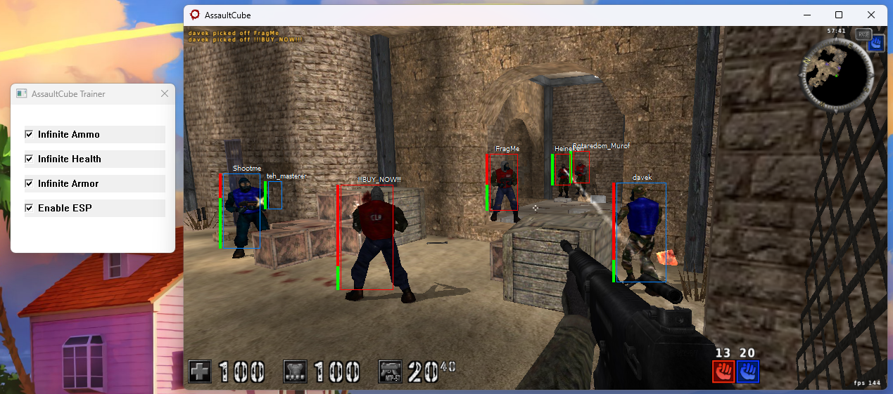

# AssaultCube External Trainer (Learning Project)

This project is an **external trainer for AssaultCube (v1.3)**.  
It was built for **learning purposes**, mainly to explore:

- Remote process memory reading/writing
- Light reverse engineering
- External overlay rendering
- 2D ESP (World-To-Screen projection)

The goal is **not to use this online or maliciously**, but to understand **how an external cheat works internally**.

---

## ✨ Features

✔ **ESP (External Overlay)**
- 2D box ESP
- Player name ESP
- Colored health bar
- Team detection (Blue / Red)
- World-To-Screen based on the view matrix

✔ **Player Hacks**
- Infinite Ammo (Assault Riffle only)
- Infinite Health
- Infinite Armor

✔ **Memory Handling**
- Static offset-based access
- Pointer chain resolving
- External Read/Write

✔ **Reverse Engineering**
- Static offsets (v1.3)
- Entity list + head/feet coordinates
- External ViewMatrix access

---

## 🧰 Technologies & Concepts

- **Language:** C++17
- **API:** Win32
- **Tools:**
  - Visual Studio 2022
  - DebugView (overlay logging)

- **Concepts explored:**
  - External process memory manipulation
  - Transparent Win32 overlay
  - Multi-threading
  - Matrix transformations (World-To-Screen)
  - Modern C++ structs & classes

---

## 🖥 Requirements & Dependencies

- Windows 10/11
- AssaultCube 1.3 (local, offline)
- Visual Studio
- Windows SDK installed

---

## ⚠ Disclaimer

This project is for **educational purposes only**.  
Do **not** use it online or to gain unfair advantage over real players.  
Learning reverse engineering & low-level concepts is the main goal.

---

## 📝 License

MIT

